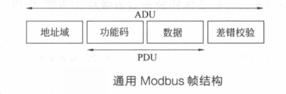

# 1 什么是Modbus通讯协议
Modbus是一种串行通信协议，是Modicon公司（现在的施耐德电气Schneider Electric）于1979年为使用可编程逻辑控制器（PLC）通信而发表。Modbus已经成为工业领域通信协议的业界标准（De facto），并且现在是工业电子设备之间常用的连接方式。   

Modbus协议目前存在用于串口、以太网以及其他支持互联网协议的网络的版本。大多数Modbus设备通信通过串口EIA-485物理层进行。 
# 2 Modbus通讯方式

## 2.1 串行连接 RTU
对于串行连接，存在两个变种，它们在数值数据表示不同和协议细节上略有不同。Modbus RTU是一种紧凑的，采用二进制表示数据的方式。`RTU格式后续的命令/数据带有循环冗余校验的校验和。(CRC)`
## 2.2 串行连接 ASCII
Modbus ASCII是一种人类可读的，冗长的表示方式。`ASCII格式采用纵向冗余校验的校验和。(LRC)`
## 2.3 TCP/IP以太网连接
对于通过TCP/IP（例如以太网）的连接，存在多个Modbus/TCP变种，`这种方式不需要校验和计算。`  

对于所有的这三种通信协议在数据模型和功能调用上都是相同的，只有封装方式是不同的。Modbus允许多个 (`247个`) 设备连接在同一个网络上进行通信，

## 2.4 常用术语
|  名称  |      实义      | 名称  |     实义     |
| :----: | :------------: | :---: | :----------: |
| Master |     主设备     |  ADU  | 应用数据单元 |
| Slave  |     从设备     |  PDU  | 协议数据单元 |
| Client |     客户端     |  MSB  |  最高有效位  |
| Server |     服务器     |  LSB  |  最低有效位  |
|  MBAP  | ModbusTCP数据帧报头 |

## 2.5 主从设备里连接基本要素
Modbus协议是一个master/slave架构的协议。有一个节点是master节点，其他使用Modbus协议参与通信的节点是slave节点。每一个slave设备都有一个唯一的地址。在串行网络中，只有被指定为主节点的节点可以启动一个命令（在以太网上，任何一个设备都能发送一个Modbus命令，但是通常也只有一个主节点设备启动指令）。  
一个ModBus命令包含了打算执行的设备的Modbus地址。所有设备都会收到命令，但只有指定位置的设备会执行及回应指令（地址0例外，指定地址0的指令是广播指令，所有收到指令的设备都会运行，不过不回应指令）。所有的Modbus命令包含了检查码，以确定到达的命令没有被破坏。基本的ModBus命令能指令一个RTU改变它的寄存器的某个值，控制或者读取一个I/O端口，以及指挥设备回送一个或者多个其寄存器中的数据。  

总线上只能有一个主设备,但可以有一个或者多个(最多247个)从设备。  
`Modbus通信总是由主设备发起，当从设备没有收到来自主设备的请求时,不会主动发送数据。从设备之间不能相互通信，主设备同时只能启动一个Modbus访问事务`

## 2.6 Modbus基本帧格式

## 2.7 产生异常
如果出现与请求Modbus功能有关的差错,那么响应报文的功能码域将包括一个异常码,主机设备(或客户端)能够根据异常码确定下一个执行的操作。 

对于异常响应,从机设备(或服务器端)将返回一个与原始功能码等同的码值,但设置该原始功能码的最高有效位为逻辑1,用于通知主机设备(或客户端)。(详见#7：异常码)`P8`

# 3 Modbus串行数据帧简述

## 3.1 地址域  

所谓地址域，指的是Modbus通信帧中的地址字段,其内容为从设备地址。`Modbus消息帧的地址域包含2个字符(ASCII模式)或者1个字节(RTU模式)。`  
消息帧中可能的从设备地址是0~247(十进制),单个设备的实际地址范围是1~247。`主设备通过将要联络的从设备的地址放入消息中的地址域来选通从设备。当从设备发送回应消息时，它把自己的地址放人回应的地址域中,以便主设备知道是哪一个设备做出回应。`  
地址0用作广播地址,广播方式可能不被允许或以其他方式代替。
## 3.2 功能码
功能码域由1个字节构成，因此其取值范围为1~255(十进制)。例如，常用的功能码有01、02、03、04、06、15、16等,其中： 

| 功能码 |       作用       | 寄存器PLC地址 | 位/字操作 |   操作数   |
| :----: | :--------------: | :-----------: | :-------: | :--------: |
|  0x01  |    读线圈状态    |  00001-0999   |  位操作   | 单个或多个 |
|  0x03  |   读保持寄存器   |  40001-49999  |  字操作   | 单个或多个 |
|  0x0F  |    写多个线圈    |  00001-09999  |  位操作   |    多个    |
|  0x10  | 写多个保持寄存器 |  40001-49999  |  字操作   |    多个    |

## 3.3 数据域
数据域与功能码紧密相关,存放功能码需要操作的具体数据。数据域以字节为单位,长度是可变的,对于有些功能码,数据域可以为空。

## 3.4 差错校验码
在Modbus串行通信中,根据传输模式(ASCII或RTU)的不同,差错校验域采用了不同的校验方法。

### 3.4.1  ASCII模式
在ASCII模式中,报文包含一个错误校验字段。该字段由两个字符组成,`其值基于对全部报文内容执行的纵向冗余校验(LRC)计算的结果而来,计算对象不包括起始的冒号(:)和回车换行符号(CRLF)。`
### 3.4.2 RTU模式
在RTU模式中,报文同样包含一个错误校验字段。与ASCII模式不同的是，该字段由16个比特位共两个字节组成。`其值基于对全部报文内容执行的循环冗余校验(CRC-16)计算的结果而来,计算对象包括校验域之前的所有字节。`  
若接收数据端发现CRC校验码不正确，则弃置该报文。
CRC校验:  
(1）预置一个值为ОxFFFF的16位寄存器,此寄存器为CRC寄存器。  
(2）把第1个8位二进制数据(即通信消息帧的第1个字节)与16位的CRC寄存器的相异或,异或的结果仍存放于该CRC寄存器中。  
(3）把CRC寄存器的内容右移一位,用0填补最高位，并检测移出位是О还是1。  
(4）如果移出位为零,则重复步骤(3)(再次右移一位);如果移出位为1,则CRC寄存器与0xA001进行异或。    
(5）重复步骤(3）和(4)，直到右移8次,这样整个8位数据全部进行了处理。  
(6）重复步骤(2)～(5)，进行通信消息帧下一个字节的处理。  
(7）将该通信消息帧所有字节按上述步骤计算完成后,得到的16位CRC寄存器的高﹑低字节进行交换。即发送时首先添加低位字节，然后添加高位字节。  
(8）最后得到的CRC寄存器内容即为CRC校验码。  

# 4 大小端存储（LSB<-MSB，MSB<-LSB）
概念不再赘述 `P52`

| Int/ (Long)Float(32Bits) | Double(64Bits) |
| :----------------------: | :------------: |
|          AB CD           |  AB CD EF GH   |
|          CD AB           |  GH EF CD AB   |
|          BA DC           |  BA DC FE HG   |
|          DC BA           |  HG FE DC BA   |
# 5 TCP数据帧
在Modbus TCP/IP协议中,`串行链路中的主/从设备分别演变为客户端/服务器端设备。即客户端相当于主站设备,服务器端相当于从站设备。  `
基于TCP/IP网络的传输特性,串行链路上一主多从的构造也演变为多客户端/多服务器端的构造模型。Modbus TCP/IP服务器端通常使用端口502作为接收报文的端口。

在TCP/IP网络上的Modbus协议需要引入一个称为MBAP(Modbus Application Header)报文头的字段。  
`Modbus TCP/IP协议最大帧数据长度为260字节,其中字节0~6构成MBAP报头.`

## 5.1 数据帧与报头说明

对单纯的Modbus TCP/IP设备来说,利用IP地址即可寻址Modbus服务器端设备,此时Modbus单元标识符是无用的,必须使用值0xFF填充。  
当对直接连接到TCP/IP网络上的Modbus服务器寻址时，建议不要在“单元标识符”域使用有效的Modbus从站地址。

`Modbus协议规定,起始地址由2个字节构成，取值范围为0x0000~0xFFFF; `   
`线圈数量由2个字节构成,取值范围为0x0001~0x07D0(即十进制1~ 2000)。` `P61 查询报文`

# 6 RTU数据帧

传输设备(主/从设备)将Modbus报文放置在带有已知起始和结束点的消息帧中,这就要求接收消息帧的设备在报文的起始处开始接收﹐并且要知道报文传输何时结束。另外还必须能够检测到不完整的报文，且能够清晰地设置错误标志。  
在RTU模式中,`消息的发送和接收以至少3.5个字符时间的停顿间隔为标志。`实际使用中,网络设备不断侦测网络总线，计算字符间的停顿间隔时间,判断消息帧的起始点。当接收到第一个域(地址域)时,每个设备都进行解码以判断是否停顿标定了消息的结束，而一个新的消息可在此停顿后开始。另外，在一帧报文中，必须以连续的字符流发送整个报文帧。必须以连续的字符流发送整个报文帧。`如果两个字符之间的空闲间隔大于1.5个字符时间,那么认为报文帧不完整,该报文将被丢弃。`

ModbusRTU数据帧要求`一帧结束后，与下一帧时间间隔至少有大
于等于3.5个字符的时间间隔`那么在波特率为9600bps的情况下,只要大于4.0104167ms即可!   `P37`（延时？）

## 6.1 地址域(RTU)

`RTU模式消息帧的地址域1个字节。`

消息帧中可能的从设备地址是0~247(十进制)。(248-255保留)`主设备通过将要联络的从设备的地址放入消息中的地址域来选通从设备。当从设备发送回应消息时,它把自己的地址放入回应的地址域中`,以便主设备知道是哪一个设备做出回应。
## 6.2 功能码(RTU)
`见3.2`  
从设备根据功能码执行对应的功能,执行完成后,正常情况下则在返回的响应消息帧中设置同样的功能码;如果出现异常,则在返回的消息帧中将功能码最高位(MSB)设置为1。据此,主设备可获知对应从设备的执行情况。  
另外,对于主设备发送的功能码，则从设备根据具体配置来决定是否支持此功能码。如果不支持，则返回异常响应。
## 6.3 数据域(RTU)
`见3.3`
## 6.4 差错控制(RTU)
`见3.4.2`
# 7 异常码
对于查询报文﹐存在以下4种处理反馈:
## 7.1 正常
正常接收﹐正常处理,返回正常响应报文﹔
## 7.2 通信错误
从站设备没有接收到查询报文，主站设备将按超时处理;  
## 7.3 查询报文存在通信错误
(例如LRC,CRC错误等)，此时从站设备将丢弃报文不响应﹐主站设备将按超时处理;  
## 7.4 报文正确,但是超过处理范围
(例如,不存在的功能码或者寄存器等),此时从站设备将返回包含异常码(Exception Code)的响应报文。  
异常响应报文由从站地址、功能码以及异常码构成。其中,功能码与正常响应报文不同,在异常响应报文中,功能码最高位(即MSB)被设置为1。因为Modbus协议中功能码占用一个字节,故用表达式描述为:异常功能码=正常功能码＋0x80。
## 7.5 异常码表
| 异常码 |  作用  |  寄存器PLC地址  |
| :----:| :-------: | :-----------: |
|0x01|非法功能码 |从站设备不支持此功能码 |
|0x03|非法数据地址|指定的数据地址在从站设备中不存在|
|0x0F|非法数据值|指定的数据超过范围或不存在|
|0x10| 从站设备故障|从站设备处理响应的过程中，出现未知错误等|